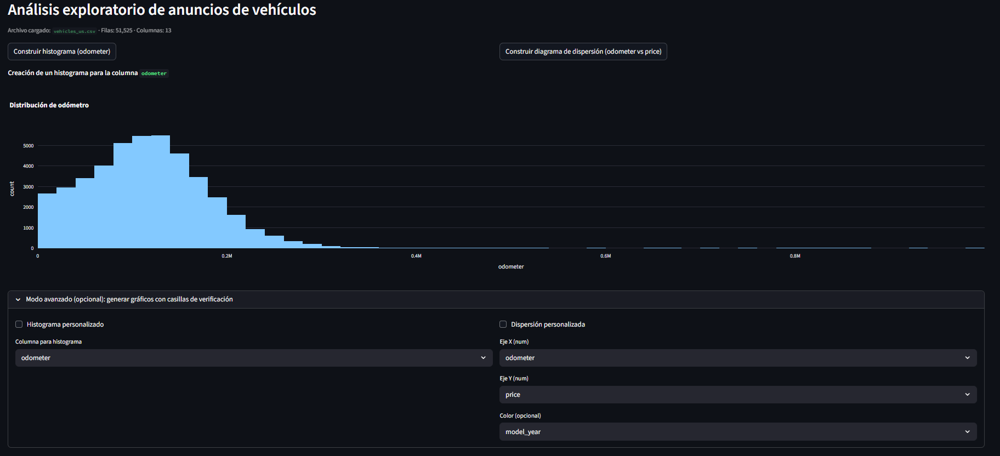
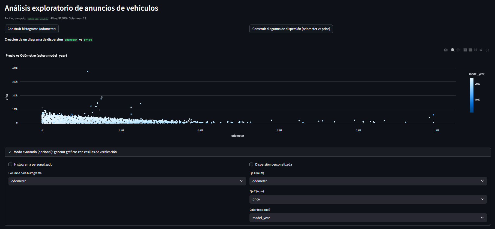

# Used Car Market Analysis – Streamlit App

Aplicación web interactiva para explorar datos de anuncios de vehículos usados mediante visualizaciones dinámicas.

## Contexto del proyecto

El mercado de vehículos usados genera grandes volúmenes de datos sobre precios, kilometraje, modelo y condición de los vehículos. Analizar estos datos permite identificar patrones que influyen en el valor de mercado de los autos.

Este proyecto realiza un **análisis exploratorio de datos (EDA)** y presenta los resultados mediante una **aplicación web interactiva**.

## Objetivo

Explorar el dataset de anuncios de vehículos para identificar relaciones entre variables clave como:

- Precio
- Kilometraje
- Año del vehículo
- Condición

## Dataset

El dataset contiene anuncios de venta de vehículos usados e incluye variables como:

- `price`
- `odometer`
- `model_year`
- `condition`
- `type`
- `date_posted`

## Análisis exploratorio (EDA)

Se analizaron diferentes variables para entender la estructura de los datos y detectar patrones relevantes.

Algunos análisis realizados:

- Distribución de precios de vehículos
- Relación entre kilometraje y precio
- Comparación de precios según condición del vehículo
- Tendencias en publicaciones de anuncios

## Aplicación web

Se desarrolló una aplicación con **Streamlit** que permite generar visualizaciones interactivas.

La aplicación permite:

- Crear histogramas de variables del dataset
- Explorar relaciones entre variables mediante gráficos de dispersión
- Visualizar datos de forma interactiva

## Demo en línea

Aplicación desplegada en Render:

https://proyecto-final-sprint-7.onrender.com/

## Tecnologías utilizadas

- Python
- Pandas
- Plotly Express
- Streamlit
- Git / GitHub
- Render

link aplicación Render https://proyecto-final-sprint-7.onrender.com/

## Vista de la aplicación





## Ejecución local

Instalar dependencias:

##  Demo local

```bash
python -m pip install -r requirements.txt
python -m streamlit run app.py
